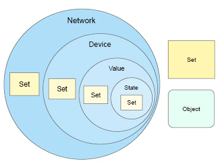

# wapp-api

It is a set of helpful JavaScript classes and functions that will speed up the wapp development process.

# Table of Contents
1. [What is a Wapp](#what-is-a-wapp)
  * [Unified Data Model](#udm-structure)
2. [Installation](#installation)
3. [usage](#usage)

## What is a Wapp
In general, a wapp is a piece of JavaScript code that has been created with [Wappsto](https://wappsto.com/). The purposes of this code is to, e.g.:
* Connect and combine various things (IoT devices) together to create an automated system.
* Convert 3<sup>rd</sup> party data (eg. Weather forecast) into Wappsto [Unified Data Model](#udm-structure) in order to harvest and extend existing information in accounts.
* Create usable and interactive UI elements to target specific user needs.

To enable these functionalities a Wapp (application) consist of two tasks, albeit it's not required to create both of them at once:
* **Background:** a piece of JavaScript code that constantly runs server side in NodeJS environment to automate processes. The functionality can be extended with NPM packages.
* **Foreground:** it's a mix of Javascripts, HTML, and CSS code that runs browser side (User Interface) to e.g. configure these automations.

### Unified Data Model
Devices can be created by different manufacturers, just like applications and services can be developed by different companies with different visions and goals. What we are trying to achieve with Wapps is to remove obstacles that the word "different" creates, and build a connected world with your help. We achieve that by mapping all the data into our Unified Data Model (UDM).

#### UDM components

The minimal structure of the model (marked as light blue on the image below) consists of: **_Network_**, **_Device_**, **_Value_** and **_State_** JSON objects. Optionally, the model can also include (marked as light yellow and green on the image below): **_Set_** and **_Object_** JSON objects.

> Once you start working with wapp-api, you will be using these objects to describe and store your data.

<div align="center">
  
</div>

##### Network
It's a main pillar of UDM as it groups underlying components, such as devices:

Key name | Value type | Description
-------- | -----------| -----------
name | String | User-friendly network name.
device | Array | An array of **_Device_** objects.
meta | Object | Information about the object generated by the API.

Provision of the keys in question is optional when creating an object.

JSON example:

``` json
{
  "name": "Smart Gateway D043",
  "device": []
}
```

##### Device
It describes a group of **_Value_** objects, it gives an overview of what is their communication protocol etc.

Key name | Value type | Description
-------- | -----------| -----------
name | String | User-friendly device name.
manufacturer | String | Device manufacturer.
product | String | Device Product identifier.
version | String | Device Version.
serial | String | Device identification number.
description | String | Device description.
protocol | String | Communication protocol.
communication | String | Communication type.
value | Array | An array of **_Value_** objects.
meta | Object | Information about the object generated by the API.

Provision of the keys in question is optional when creating an object.

JSON example:

``` json
{
  "name": "Sensor",
  "manufacturer": "SmartSensors",
  "version":"1.2",
  "serial": "0123456",
  "description": "Smart sensor device that measures humidity and temperature every 15 minutes.",
  "communication": "Always Online",
  "value": []
}
```

##### Value
It's a description of a valuable data that comes from a certain source. It describes how the data should be treated, displayed, what permission does it have and what is its purpose.

Key name | Value type | Description
-------- | ---------- | -----------
name | String | User-friendly name of a value.
type | String |	Generic value type (eg: temperature, humididty, camera, etc.)
permission | Enum: r, w, rw, none | Denotes if this value is read-only "r", write-only "w", or both "rw". If set to "none", value state do not exist yet.
status | Enum: ok, pending, update| Status of the value.
state | Array | An array of **_State_** objects. You can only create up to two objects, depending on the selected _permission_ value.
number/string/blob/xml | Object | One of these options defines value data type, [read more here](https://documentation.wappsto.com/restapi/#tag/Value/paths/~1value/post).

JSON example:

``` json
{
  "name": "relative humidity",
  "type": "humidity",
  "permission":"r",
  "status":"ok",
  "number": {
    "min": 0,
    "max": 100,
    "step": 1,
    "unit": "%"
  },
  "state": []
}
```


## Installation

If you are developing a **Background** task use:

``` bash
npm install --save wapp-api
```

for the **Foreground** task, add the following tag to the HTML page:

``` javascript
<script src="https://cdn.jsdelivr.net/npm/wapp-api@latest/browser/wapp-api.js"></script>

// or if you prefer to load it locally:
<script src="browser/wapp-api.js"></script>
```

## Usage

To use wapp-api, you need first an instance of `Wappsto` class.
```javascript
const Wappsto = require('wapp-api'); // If you're using NodeJS.

const wappsto = new Wappsto({...});
```

It's optional to pass an object with the following keys to the constructor:
* `baseUrl` (String): prefix for the URL.
* `session` (String): Set custom installation session.
* `token` (String): An installation token associated with [extsync](#extsync) requests.
* `version` (String): Set a default version of documents.
* `serviceVersion` (Object): Set a version of service. Use default key to set default version for all services. Ex: ```{ default: '2.0', network: '', stream: '2.1' }```.

In `wappsto.util` object you can access these options.

It is possible to debug a **Background** task using browser's DevTools. All the wapp console logs will be shown in the DevTools Console:

``` javascript
const { start, end } = require('wapp-api/console');
```

> Remember to remove this piece of code before publishing your wapp.

Exposed properties:
* `start` (Function): start sending the logs.
* `stop` (Function): stop sending the logs.


## Related

- [wapp-cli](https://github.com/Wappsto/wappsto-cli)

## License

Apache 2.0 © [Seluxit A/S](http://seluxit.com)
